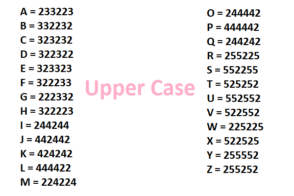
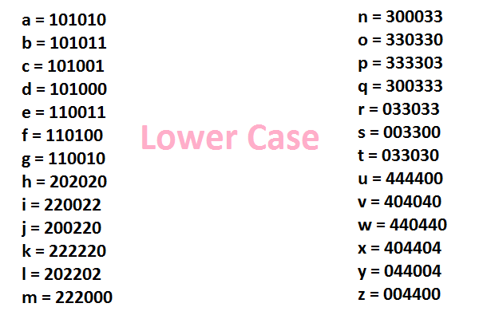
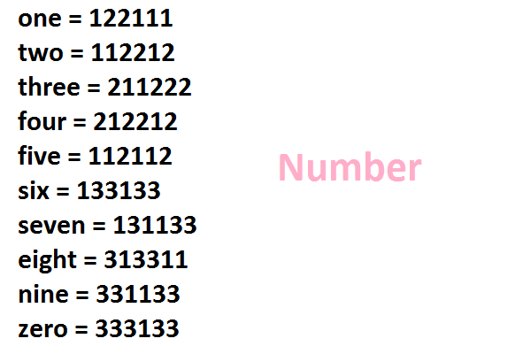
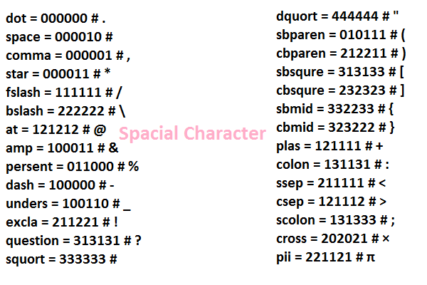
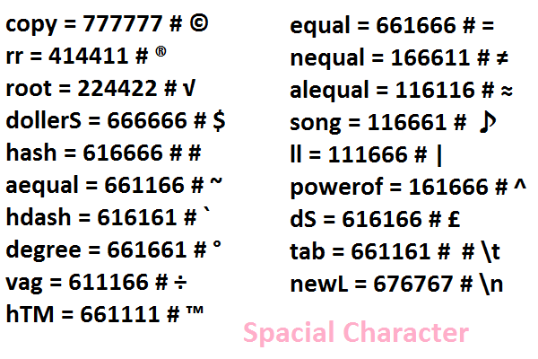

# Num6 - A Powerful Encrypter And Decrypter Tool
**Version 0.1**

Num6 is a very intelligent and efficient Encrypter and Decrypter. 
It is very fast and mostly user friendly.
Every characters are very much efficiently added to the library.
There just imaginary numbers not copied from anything.
All numbers are 6 digit number, this how it named **Num6**.
It is a Command Line Tools Upcoming is **GUI** Coming Soon...

**This is a Python 3 based script. Made and developed by [Md. Almas Ali](https://facebook.com/md.almasali.0)**

[](LICENSE)

## Logo


## Character Library






## **Installation:**
As this is a python package, so you will have to setup this tool by pip.

## **For Windows**
Install Python 3 then follow the steps.
```
pip install num6
```

## **For Linux**
All steps are given below
```
sudo apt-get update && sudo apt-get upgrade
sudo apt-get install python3 python3-pip
pip3 install num6
```

## **Usage**
After you have successfully install Num6 on your system, then you can import it.
```
import num6
```
You can use Two magor functions in there encrypter() and decrypter(). They takes an argument as string.

**Example**

```
import num6
num6.encrypter('This is a test string')
```
**Output**
```
'525252202020220022003300000010220022003300000010101010000010033030110011003300033030000010003300033030033033220022300033110010'
```
Now how can you decrypt it like ugly looking number.

**Example**
```
import num6
num6.decrypter('525252202020220022003300000010220022003300000010101010000010033030110011003300033030000010003300033030033033220022300033110010')
```
**Output**
```
'This is a test string'
```

## External Use
You can also use it as a script.

## For any bug report feel free to set a pull request or issue in Github

Our Github link : [Num6](https://github.com/almas-ali/num6)